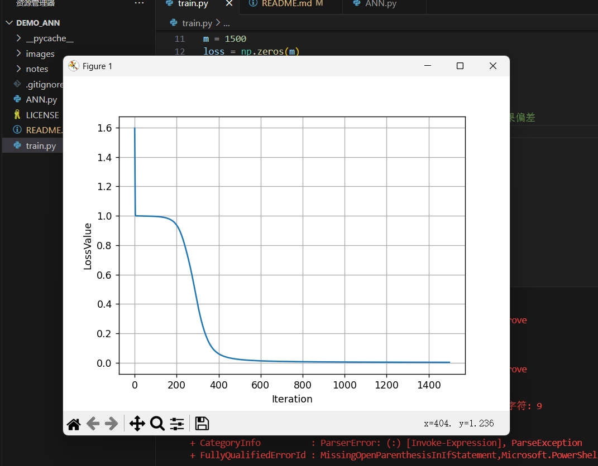

# demo-ANN
最基础的BP神经网络，旨在原理上的理解，理解所有神经系统的本质
参考教程 python 手动搭建ANN，并进行具体实现

用 Python 手动进行 ANN 的搭建（简单的BP型网络），可加深对其深入的理解，同时熟练coding，具有xxx、yyy之功效。

网上手动建NN的帖子有不少，不过多数没有实现过程，这里把这一部分补上，方便大家参考使用。 

前半步主要是参考如下的帖子，建立 ANN：

https://towardsdatascience.com/how-to-build-your-own-neural-network-from-scratch-in-python-68998a08e4f6
但这个帖子有个问题，就是建立了ANN 却并没有实现过程，同时其中前后传播方法的‘feedforward’和 ‘backprop’ 中的sigmoid函数及其导数也没有具体的函数定义。

因此，进一步参考如下的网页：

http://python3.codes/neural-network-python-part-1-sigmoid-function-gradient-descent-backpropagation/
http://python.jobbole.com/82758/
另外下面的这个也不错，只是有点太细碎了，大线条看着有点乱：

http://www.bogotobogo.com/python/python_Neural_Networks_Backpropagation_for_XOR_using_one_hidden_layer.php
 

以下具体步骤：

## 1. 建立 ANN：

 有些说明在注释中写了。

复制代码
```python
 1 class NeuralNetwork:
 2     
 3     # 通过初始化的方式实现 输入‘x’及输出‘y’、以及网络权重（定义了二层4节点的网络结构） 的基本结构：
 4     def __init__(self, x, y):
 5         self.input = x
 6         self.weights1 = np.random.rand(self.input.shape[1],4) 
 7         # 这样的结构，意味着weights1的行数是输入变量x的列数，那么相乘时可能是与常规的 W·X 的方式相反，即 X·W
 8         # 因此，X的每一行，代表着一次x输入，对应着每一个输出y
 9         
10         # 同上的，这样的结构形式定义，代表的表达式或应是：[(X·W1+b1)·W2]+b2
11         ## 而在经过上述W1与W2的相乘后，每一行的x对应着一个y_i的值
12         self.weights2 = np.random.rand(4,1)
13         
14         # 对应着y作为输出，定义self.output 的结构
15         self.y = y
16         self.output = np.zeros(y.shape)
17 
18     
19     def feedforward(self): #定义前传方法：
20         # 注意忽略了每层的偏差 b_i
21         # 且转换函数使用 sigmoid()
22         # 因没有相应的函数定义，将其中的 sigmoid() 函数进行展开
23         # sigmoid(m)=1/(1 + np.exp(-m))
24        
25         npDotW1_Inpt = np.dot(self.input, self.weights1)
26         self.layer1 = 1/(1+np.exp(-1*npDotW1_Inpt))
27         
28         npDotL1_W2 = np.dot(self.layer1, self.weights2)
29         self.output = 1/(1+np.exp(-1*npDotL1_W2))
31         
32     def backprop(self): # 定义后传方法：
33         # application of the chain rule to find derivative of the loss function with respect to weights2 and weights1
34         # 以上是原文注解，即在向后传播 backprop 时，使用链式法则获得相应权重值的损失函数
35         # 因没有相应的函数定义，将原贴中的 sigmoid_derivative() 函数进行展开
36         # sigmoid_derivative(m)=m * (1 - m)
37 
38         ## 此处采用的是 s_deriv(x) = x*(1-x) 的方式，如采用 exp(-x)/(1+exp(-x))^2) 的解析式也可以，本质相同：
39         d_weights2 = np.dot(self.layer1.T, (2*(self.y - self.output) * (self.output*(1-self.output))))
40         d_weights1 = np.dot(self.input.T,  (np.dot(2*(self.y - self.output) * (self.output*(1-self.output)), self.weights2.T) * (self.layer1*(1-self.layer1))))
41     
42         # update the weights with the derivative (slope) of the loss function
43         # 通过上面的求导斜率，对W1和W2进行更新：
44         self.weights1 += d_weights1
45         self.weights2 += d_weights2            
```

## 2. 实现过程：

此步原文没有写，估计作者觉得太简单了，貂尾续根草吧。

但这里的输入和输出是按原文给的，便于对比实现结果是否一致。

```python
 1 # 建立输入和输出变量：
 2 x_input = np.array([[0,0,1],[0,1,1],[1,0,1],[1,1,1]])
 3 y_obj = np.array([[0,1,1,0]]).T
 4 
 5 # 实例化 ANN：
 6 nn = NeuralNetwork(x_input, y_obj)
 7 
 8 # 进行计算，迭代次数为1500次：
 9 m = 1500
10 loss = np.zeros(m)
11 
12 for i in range(m):
13     nn.feedforward() # 前传计算结果
14     nn.backprop() # 后传更新权重
15 
16     loss[i] = np.sum((nn.output-y_obj)**2) # 记录每次的结果偏差
17 
18 # 绘制结果图形：
19 plt.plot(loss)
20 plt.xlabel('Iteration')
21 plt.ylabel('LossValue')
22 plt.grid(True)
```

结果如图：
